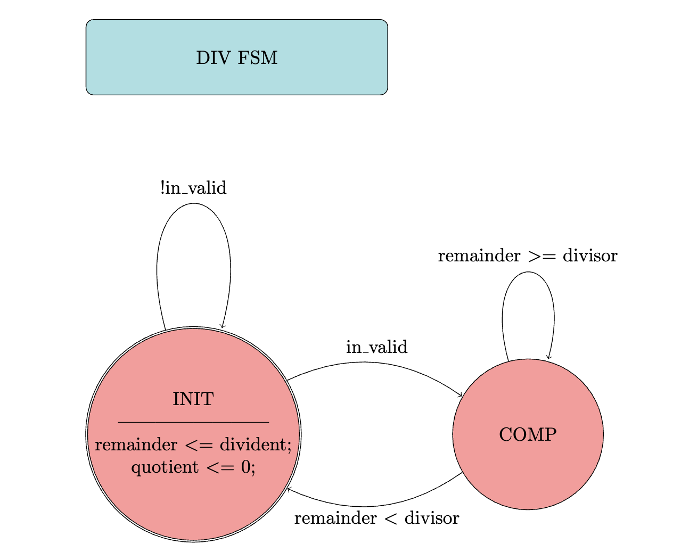
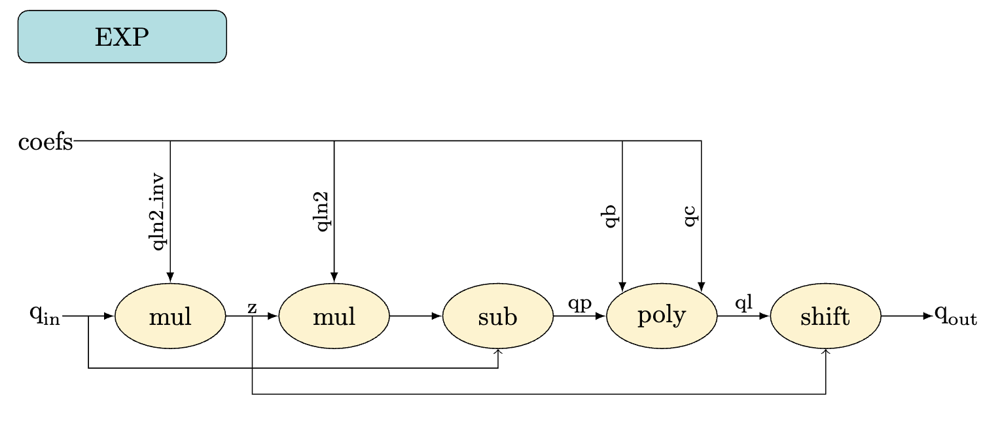
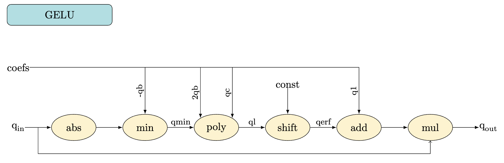
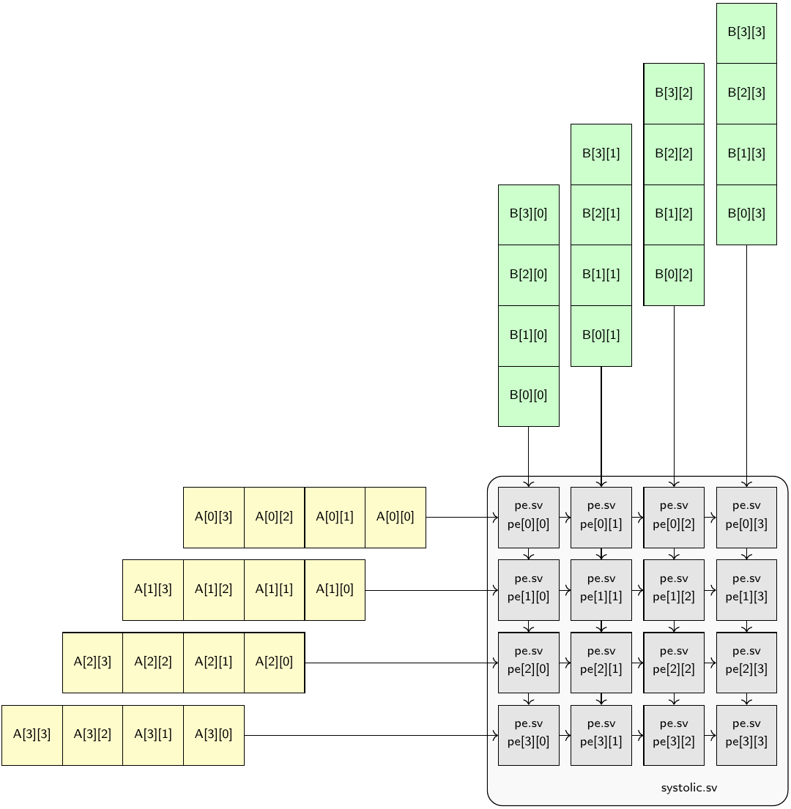
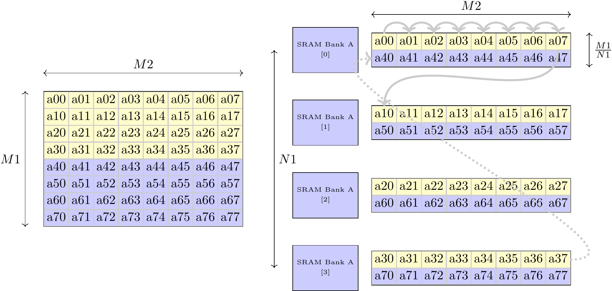
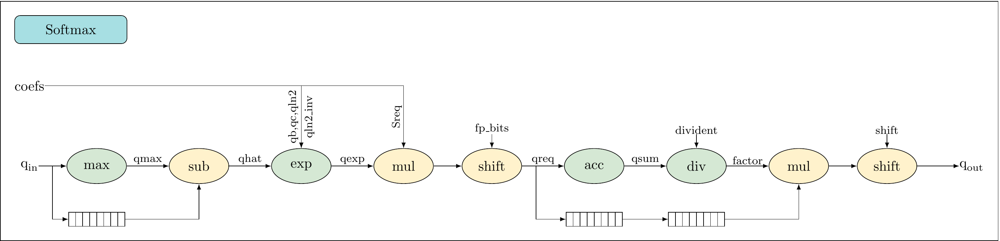
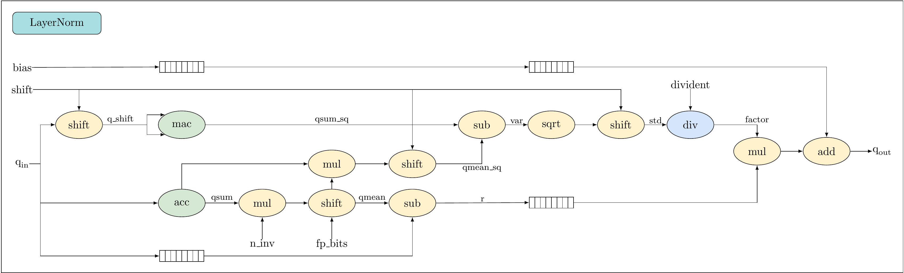
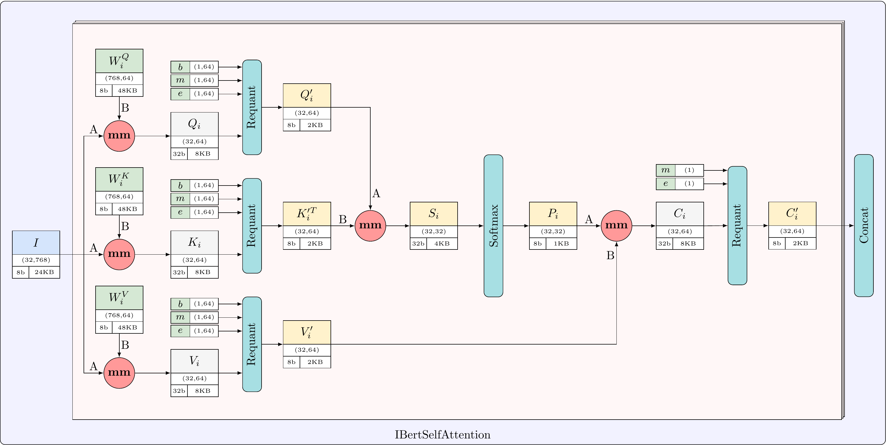

# IBERT Accelerator — Project Overview

> **Course:** ECE 327 – Digital Hardware Systems (Dr. Nachiket Kapre)  
> **Target:** Xilinx **PYNQ-Z1** FPGA  
> **Language:** SystemVerilog (RTL)  
> **Theme:** Integer-friendly transformer primitives and a minimal end-to-end token generator on FPGA

Huge thank you to **Dr. Nachiket Kapre** for making this course possible at the University of Waterloo!

## Conventions & Interfaces
- **Clock:** positive edge.
- **Reset (`rst`):** synchronous, active-high.
- **Initialize (`initialize` / `init`):** starts a fresh accumulation/transaction without discarding the current input.
- **Streaming:** ready/valid (AXI-Stream-like: `tdata`, `tvalid`, `tready`, `tlast`).
- **Latency accounting:** all pipelines document stage depth; integration aligns via shift registers/FIFOs.

<!-- *Suggested diagram:* simple **ready/valid timing** waveform showing `tvalid/tready`, a one-cycle pipeline, and where `initialize` takes effect. -->

---

## Lab 1 — Arithmetic Building Blocks

- **ACC (Accumulator):** Sums a stream `in_data` into `result` each clock; synchronous reset clears to 0. When `initialize=1`, it seeds `result` with the current sample (start fresh without dropping it). Latency: 1 cycle.

- **MAC (Multiply-Accumulate):** Computes a dot product by accumulating `a*b` each cycle. `initialize=1` seeds the sum with `a*b`; reset clears to 0.

- **MAX (Running Maximum):** Tracks the largest input seen so far; updates only when a new max arrives. `initialize` seeds with current input; reset clears to 0.

- **ARRAY (N-lane MACs):** Instantiates N independent `mac` lanes (`a[k]`, `b[k]`, `initialize[k]`) to produce parallel dot-product partial sums as a vector.

---

## Lab 2 — Integer Math Primitives

**Context:** Integer math + polynomial approximations for FPGA efficiency. EXP/GELU are **deep pipelines**; DIV is **FSM** (multi-cycle).  

---

### `div.sv` (Integer Divide, FSM)
- **Goal:** `quotient = floor(dividend / divisor)`.
- **FSM:** `INIT → COMP`  
  - **INIT:** wait for `in_valid`; latch dividend/divisor; clear quotient.  
  - **COMP:** across cycles, compute **LOPD** (leading-one position) on remainder and divisor to choose optimal shift; subtract aligned divisor; update quotient; repeat.  
  - **Done:** when remainder < divisor → assert `out_valid`, return to `INIT`.
- **Why FSM:** small area, predictable latency; avoids large combinational divider.

  

---

### `exp.sv` (Exponent Approx., Pipelined)
- **Approach:** **2nd-order polynomial** approximation of `exp(x)` with integer/fixed-point scaling.
- **Pipeline:** multiple stages for **full throughput** (new input every cycle).
- **Trade-off:** small accuracy loss vs. large area/speed savings.

---

### `gelu.sv` (GELU Approx., Pipelined)
- **Approach:** integer-friendly polynomial/tanh-style approximation.
- **Pipeline:** full throughput—after the pipeline fills, it can accept a new input every clock and produce a result every clock.
- **Why:** smoother than ReLU; works well under quantization (iBERT-style).

---

## Lab 3 — Systolic GEMM & Memory System

### Processing Element (PE)
- **Computation:** each PE cell computes a multiply and accumulate: `out_data = in_data + in_a * in_b`.
- **Chaining:** can start fresh (`init=1`) or add to a prior partial sum (`in_data`).
- **Pipelining:** inputs are registered each cycle; once filled, the PE accepts a new input every clock and streams results every clock.
- **Latency:** one cycle per stage (steady state produces outputs every clock).

*Suggested diagram:* **single-PE datapath** (multiplier → adder → register) with pipeline registers.

---

### Systolic Array (N1 × N2)
- **Dataflow:** A grid of PEs; `A` flows **left→right**, `B` flows **top→down**; partial sums move across rows one hop per cycle.
- **Output:** row results emerge from the **rightmost** PEs.
- **Goal:** after the array is filled, sustain one new computation per PE per clock with outputs streaming each cycle.

---

### Address Generators & Banked Memory (example: Mem Write A)
- **Row-interleaved banking:** distribute rows across **N1** banks (0..N1-1), then wrap.  
  - Row 0 → bank 0, Row 1 → bank 1, …, Row N1-1 → bank N1-1, Row N1 → bank 0, etc.
- **Ring counter:** cycles 0..N1-1 to select bank per new row.
- **Base address bump:** after a full stripe of N1 rows, increase base by **M2** so the next row for bank 0 appends correctly.
- **Traversal:** `col` increments each cycle; on wrap (`M2-1 → 0`), `row++`.

---

## Lab 4 — Softmax & LayerNorm (Buffering + Sync)

### Shift Registers vs FIFOs (for latency vs depth)

| Aspect | Shift Register (SREG) | FIFO (BRAM/Register) |
|---|---|---|
| Structure | Chain of FFs (1 FF/bit/stage) | Memory with read/write pointers |
| Resource | Linear in depth × width (FF heavy) | Uses **BRAM** for large depth; small ones in regs |
| Logic | Minimal | Pointer logic + flags (full/empty) |
| Best use | Small, fixed delays (latency alignment) | Deep buffers, rate matching, back-pressure absorption |

### Shift Registers vs FIFOs (decision)
- **Shift Registers (SREG):** great for **small, fixed delays**; cheap control; poor for stalls or variable latency.
- **FIFOs:** handle **back-pressure**, **rate mismatches**, and **variable latencies**; map to **BRAM** for deeper queues → much more area-efficient.
- **Choice:** I switched to **FIFOs** to guarantee synchronized data flow across branches (especially around `exp`/`acc`/`div`) and to propagate stalls cleanly.

---

### Softmax
- **Flow:** `max` (per row/vec) → **subtract-max** → `exp` (pipelined poly) → **quantize/shift** → **accumulate sum** → **divide** to get scaling factor → **multiply** inputs by factor → optional output shift/quantize.
- **Buffering strategy:**  
  - FIFO after **`exp`** to align with the slower **sum/divide** branch.  
  - FIFO on **factor** path to rejoin with the original data stream for the final multiply.  
  - Frame with `tlast` so reductions reset correctly.
- **Numerics:** staged quantization **after `exp`** and **after normalization**; document rounding/saturation.

---

### Layer Normalization
- **11 Stages:** accumulate mean/variance → affine scale/shift.
- **Reuse:** ACC/MAC/MAX/DIV/EXP building blocks.
- **Flow:** accumulate **sum** and **sum of squares** → compute **mean** and **variance** → derive **scale** (1/std) → apply `(x − mean) * scale * gamma + beta`.
- **Buffering strategy:**  
  - FIFO on the **raw `x` stream** to wait for mean/variance path (longer).  
  - Optional FIFO after **scale** to absorb occasional stalls.  
  - Reset/flush on `tlast` to partition rows/feature windows.
- **Numerics:** fixed-point mean/var; epsilon/shift to stabilize std; quantize after affine step if downstream precision is lower.

---

## Lab 5 — Attention Head Assembly (Putting it together)

### Attention Head (`mm.sv`)
- **Compute:** Q, K, V projections via systolic GEMM → scaled dot-product (`Q·Kᵀ`) → softmax → apply to `V`.
- **Interfaces:** AXI-Stream shims on every block for clean composition.
- **Top-level:** systolic array + requant + layernorm + GELU + attention; minimal token emission path.

---

## FPGA Resource Fundamentals

### Key Terms

| Term | What It Measures | Typical Trade-offs / Notes |
|---|---|---|
| **LUTs** | Combinational logic | Wide muxes/big arithmetic grow LUTs; excessive LUTs = inefficient mapping. |
| **Slice Registers (FFs)** | 1-bit storage (pipelines/FSM) | More FFs → higher Fclk via pipelining; over-pipelining costs area. |
| **DSPs** | Hard MACs / multipliers | Prefer for big math; falling back to LUTs explodes LUT usage. |
| **Slices** | Physical grouping of LUTs+FFs | Poor packing if FF/LUT use is unbalanced; hurts P&R. |
| **BRAM** | On-chip memory | Use for large buffers/FIFOs; avoid building RAM from LUTs/FFs. |
<!-- | **F7/F8 Muxes** | Very wide mux chains | Only for very wide selects; avoid accidental inference. |
| **Unique Control Sets** | Distinct reset/enable/clock groups | Too many → routing pressure, timing closure pain. | -->

### Interactions & Rules of Thumb
- **Pipelining**: +FFs, often −LUT depth per stage → higher Fclk.  
- **Use DSPs** for multipliers/adders; ensure inference isn’t blocked by bit-width or synthesis pragmas.  
- **Use BRAM** for any meaningful buffer/table depth; leave regs for latency shims.  
- **Minimize unique control sets** by sharing resets/enables where possible.  
- **Balance**: watch Slice packing; skewed FF/LUT ratios reduce density.

---

## Synthesis/Impl Results
| Metric | Value / Notes |
|---|---|
| Fclk (post-route) | `XXX MHz` |
| LUTs | `XX,XXX` |
| FFs | `XX,XXX` |
| BRAM (36Kb eq.) | `XX` |
| DSP48 | `XX` |
| Softmax throughput | `N tokens/s` (tile size `T`) |
| Attention latency | `X cycles` (Q/K/V in → out ready) |
| Power (est.) | `X.X W @ YYY MHz` |

---

<!-- ## Verification Highlights
- **Units:** directed + random tests for ACC/MAC/MAX/DIV/EXP/GELU.
- **Scoreboards:** fixed-point golden models (Python) checked cycle-accurate.
- **Protocol assertions:** ready/valid invariants; `tlast` framing; no data loss under back-pressure.
- **TB hygiene:** never hold data/control stable while `valid=0`; register stage signals explicitly.

*Suggested diagram:* **scoreboard flow** (DUT vs golden, comparator, pass/fail flags).

--- -->

<!-- ## Lessons & Tips
- Register early/often for timing.  
- Prefer BRAM/DSP hard-macros.  
- Quantization is **staged**, not one-shot (EXP + normalization are good choke points).  
- Keep control sets in check; they stealthily wreck timing.  
- Synthesis logs are a gold mine for “why did my multiplier become LUTs?”

--- -->
